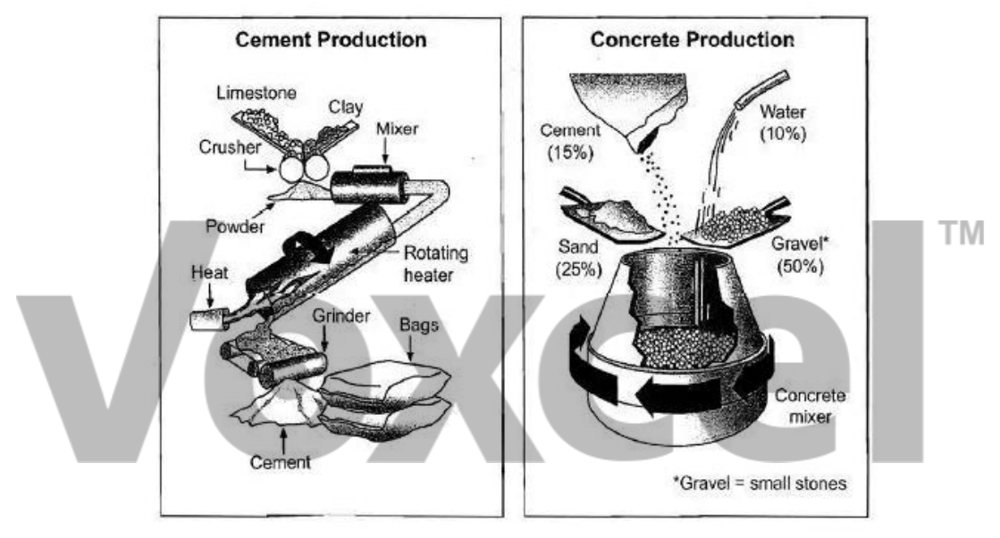

# Cambridge IELTS 8 · Test 3 · Writing Task 1

- 题号：`C8T3W1`
- 分类：流程图
- 来源：[新东方剑雅写作练习](https://ieltscat.xdf.cn/practice/write)

## Instructions

You should spend about 20 minutes on this task.

The diagrams show the stages and equipment used in the cement-making process, and how cement is used to produce concrete for building purposes. Summarise the information by selecting and reporting the main features, and make comparisons where relevant.

Write at least 150 words.

## Visual

